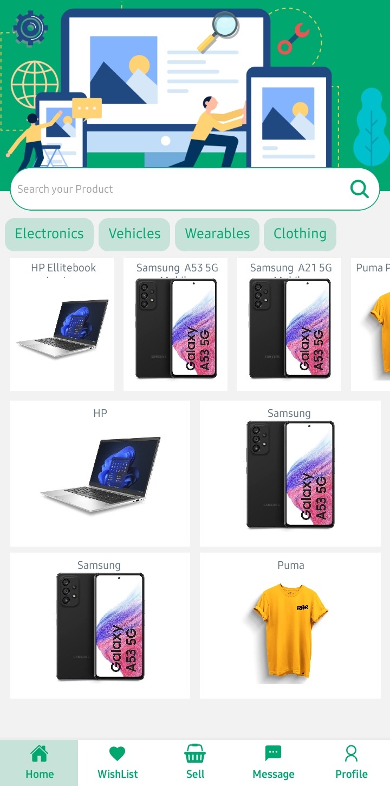
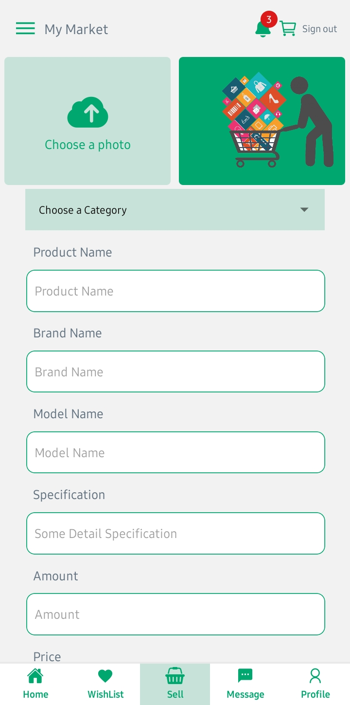
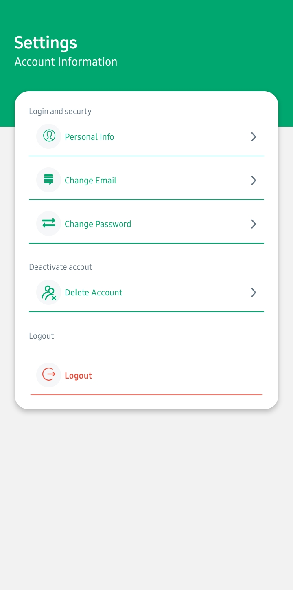
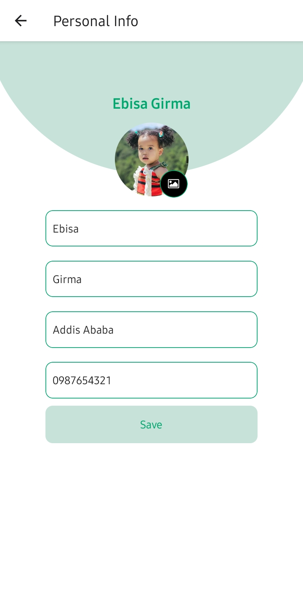
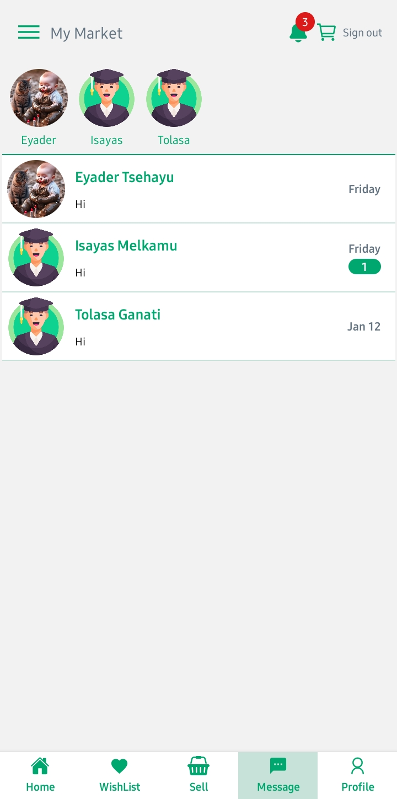
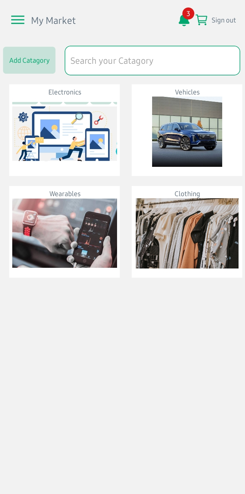
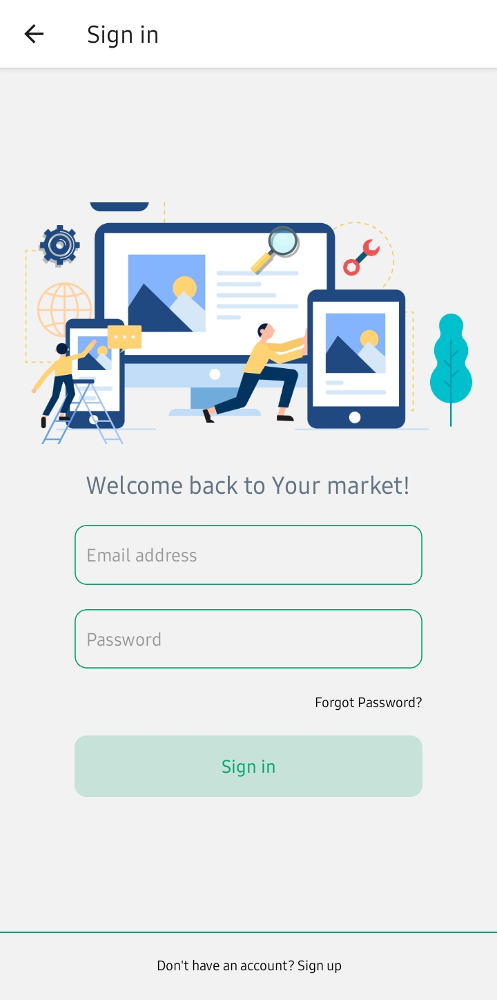
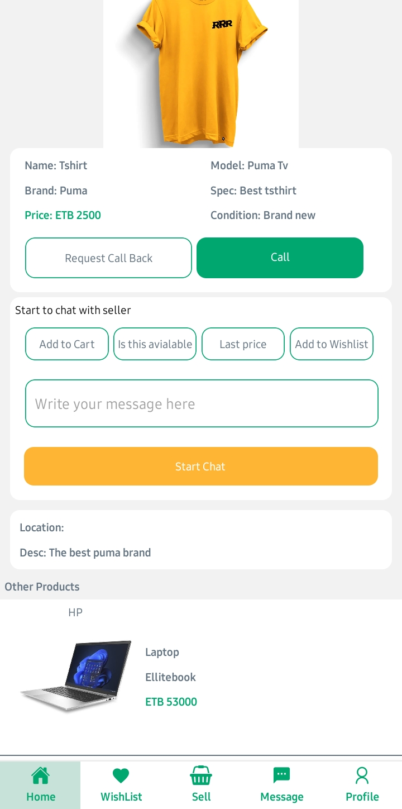

# My Marketplace - Online Marketplace Platform

## Overview

My Marketplace is a mobile application developed with React Native for the front end and Node.js with Express for the backend. It enables users to buy and sell items through a seamless and interactive platform. Real-time communication is facilitated using Socket.io.

## Features

- User authentication and authorization.
- Product browsing, listing, and purchasing.
- Image uploading for product listings.
- Real-time chat using Socket.io.
- Notifications for various events.
- ...

## Installation

### Frontend (React Native)

1. Clone the repository:

   ```bash
   git clone https://github.com/EbisaGirma21/Online_Marketplce_Platform_React_Native.git
   cd Online_Marketplce_Platform_React_Native
   ```

2. Install dependencies:

   ```bash
   npm install
   ```

3. Start the development server:

   ```bash
   expo start
   ```

   This will launch the Expo development server.

4. Use the Expo Go app on your mobile device or an emulator to run the app.

### Backend (Node.js with Express)

1. Navigate to the `backend` directory:

   ```bash
   cd api
   ```

2. Install dependencies:

   ```bash
   npm install
   ```

3. Set up environment variables:

   Create a `.env` file in the `backend` directory and add the following:

   ```env
   PORT=3000
   DATABASE_URL=your_database_url
   JWT_SECRET=your_jwt_secret
   ```

4. Start the backend server:

   ```bash
   npm start
   ```

   The server will run on the specified port (default: 3000).

## Technologies Used

### Frontend

- React Native
- Expo
- React Navigation
- Axios
- Socket.io-client
- ...

### Backend

- Node.js
- Express
- Socket.io
- Multer (for file uploads)
- ...

## Screenshots 📷

&nbsp;&nbsp;&nbsp;
&nbsp;&nbsp;&nbsp;
&nbsp;&nbsp;&nbsp;

<br>
&nbsp;&nbsp;&nbsp;
&nbsp;&nbsp;&nbsp;
&nbsp;&nbsp;&nbsp;


## Contributing

Contributions are welcome! Please follow the [Contribution Guidelines](CONTRIBUTING.md).

## Feedback

I appreciate your input! If you have any suggestions, encounter issues, or have feature requests, kindly raise them by opening an issue on our GitHub repository. Your feedback is valuable to Me! [GitHub repository](https://github.com/EbisaGirma21/Online_Marketplce_Platform_React_Native/issues).

## License

This project is licensed under the [MIT License](LICENSE).
